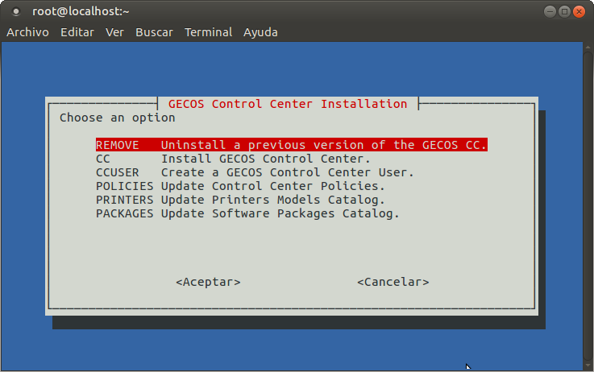
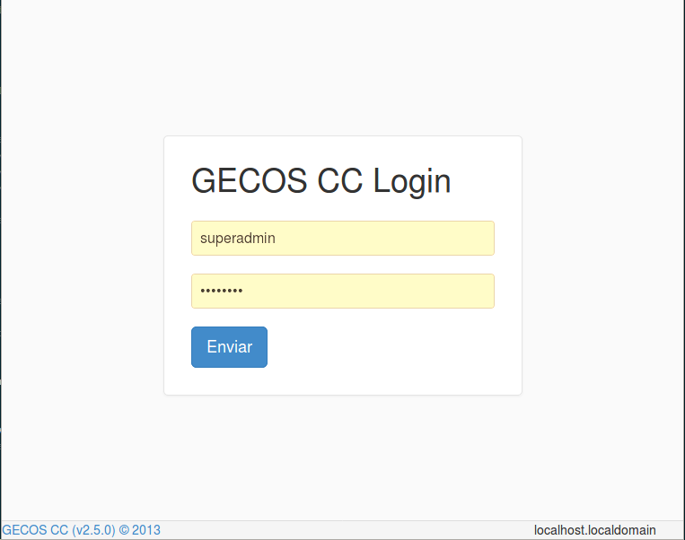

# gecoscc-installer

This script installs and configure [__GECOS Control Center__](https://gecos-team.github.io). At the end of this process you will have a complete and modern solution for corporate workstation management.

## Minimum requirements

In order to get __GECOS Control Center__ installed, your server must have:

__Minimal host__
* 64-bits architecture
* 1 CPU
* 6 GB of RAM memory 
* Red Hat 7 / CentOS 7
* 15 GB of free disk space in `/home` partition
* An FQDN
* Internet access

__Recommended host__
* 64-bits architecture
* 4 CPU
* 16 GB of RAM memory 
* Red Hat 7 / CentOS 7
* 15 GB of free disk space in `/home` partition
* An FQDN
* Internet access

This installer has been tested in [CentOS](https://centos.org) 7 minimal (64bits) and [Red Hat Enterprise Linux](https://redhat.com) 7 64bits (base install). In case your operating system is Red Hat, you should have your suscription updated.

## Installation instructions

1. From your `root` account (or some other user with privileges), download the installer from [`http://bit.ly/gecoscc-installer`](http://bit.ly/gecoscc-installer).
~~~
curl -L http://bit.ly/gecoscc-installer > gecoscc-installer.sh
~~~

2. Run the installer.
~~~
bash gecoscc-installer.sh
~~~

The first time you run the installer several packages will be installed in your system (docker, docker-compose, firewalld, unzip, ...), so it might take a while before displaying the main menu.

3. Select the `CC` option in the menu in order to install the GECOS Control Center.

## Configuration

1. Run the installer again, create an administrator user (`CCUSER` option in the menu).
~~~
bash gecoscc-installer.sh
~~~

2. This command will show some messages with important data like your superadmin password. Do not forget to write them down!
~~~
The generated password to GCC is: xxxxx
~~~

3. Now you should be able to log in into your brand new __GECOS Control Center__, using your favorite web browser. Just point it to your server's name or IP address.

## Catalogues

Once you reach into your Control Center you may populate your system installing policies, printers and packages. This catalogues are optional but it is strongly recommended to install at least a policies catalogue for a better user experience.

Run the installer, once more.
~~~
bash gecoscc-installer.sh
~~~

Execute the options that feed the system with:
1. `POLICIES`. It will download and install last version of workstation policies.
2. `PRINTERS`. It will download and install a catalogue with +4000 printer models.
3. `PACKAGES`. It will download and install a huge catalogue of software to install in your workstations.

You can repeat these steps as many times as you need in order to keep your __GECOS Control Center__ updated.

## Logging in

Just point your web browser to your server's IP address and log in with your superuser information.

## Troubleshooting
* **What services must I check to ensure that everything is up and running?**
You must check the "docker" service and the "firewalld" service.

* **How can I check that all the docker containers are running?**
The docker containers are created with the "gecos" user account. So you can check then by executing:
~~~
su - gecos
docker ps
~~~

* **Where are the important data, configuration files and logs stored?**
The data, configuration files and logs are stored in the /data directory.

* **How can I see the logs that are not stored in the /data directory?**
You can see them by using the "docker logs" command.

* **What ports are opened in the host machine?**
The opened ports are: TCP 80 (GECOS Control Center) and TCP 443 (Opscode Chef Server). The TCP 443 port is opened (on service start) and closed (on service stop) in the "gecoscc" service configuration file (/etc/systemd/system/gecoscc.service). Firewalld is used to redirect the traffic from TCP 443 port to TCP 80443 port.

